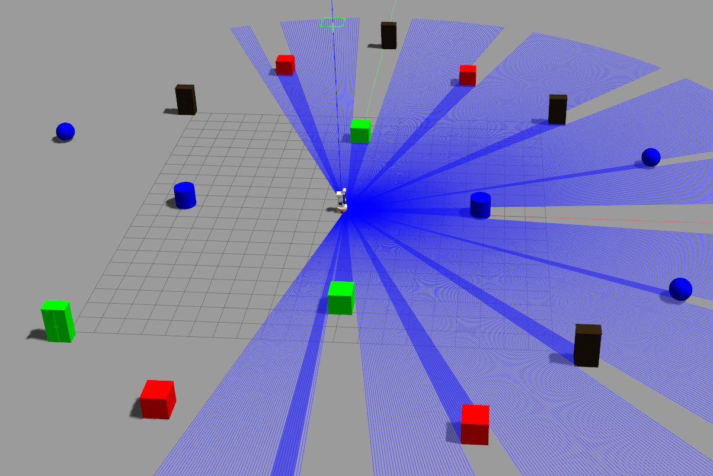
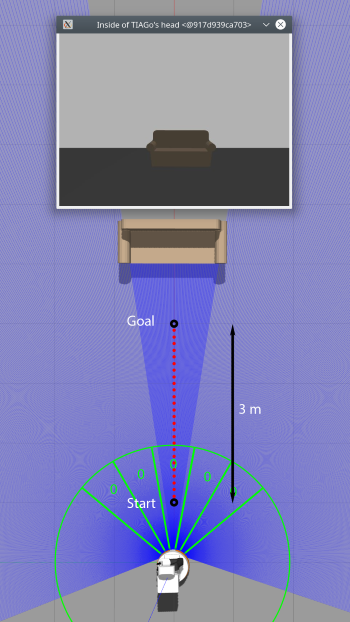
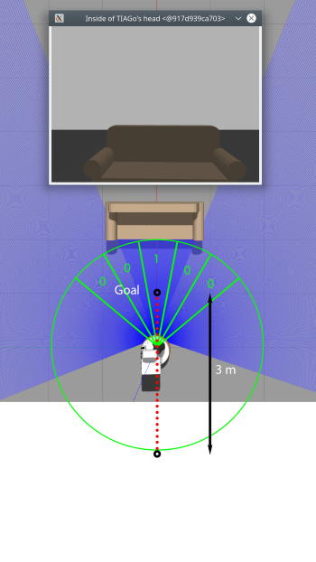

# ss20_01_data_acquisition

This package is concerning with a data acquisition controller. The node has a robot
gatjeromg data in simulation to collect sensor input. Laser, camera and odometry
input are stored in as bagfiles at **/root/.ros/bagfiles/** inside the running
container and used in **ss20_02_feature_extraction** for further processing.

Before launching this node, the Tiago simulation needs to be started as 
mentioned above. To include a environemnt for training, one of the provided
environments can be launched with the following command. This example will
launch the environment 3.

```bash
rosrun gazebo_ros spawn_model -file /root/catkin_ws/src/ss20_lanz_2d_obstacle_avoidance/source/files/environments/env3/model.sdf -sdf -model model
```

Gazebo should now look similar to the following screenshot.



To launch the node for the first time, the git repository projects need to be
built with the following commands.
```bash
cd ~/catkin_ws
catkin build
source ~/catkin_ws/devel/setup.bash
```

The node can be run without
```bash
roslaunch ss20_01_data_acquisition ss20_01_data_acquisition.launch
```

or with parameters.
```bash
roslaunch ss20_01_data_acquisition ss20_01_data_acquisition.launch args:='-m <value> -a <value>'
```
[-m <value>] Can be set to 0 or 1. Value 0 will launch the robot normally 
recording the amount of bagfiles stated in [-a \<value\>]. If [-m \<value\>] is set 
to 1, the robot will  add bagfiles to the collection already existing in 
/root/.ros/bagfiles/.

Following image shows the Robot 5 meters from an obstacle. As the first step,
the robot is going to turn till pointing towards the obstacle and then drive
towards the obstacle while starting to record image and laser input. The
recording is started 4 meters from the object, at the starting position. The
recording ends once the robot reaches the goal position which is 0.5 me from the
obstacle.



If no obstacles are within the green ranges of the laser, the input for these
ranges are set to zero. If an obstacle is entering one of these ranges, the
input values are set to one. This informations serves as the ground truth used
for training the neural network. In the following picture, the robot is about
2 meters before the obstacle, with the front laser range recognizing an obstacle
and therefore setting the input to 1.

