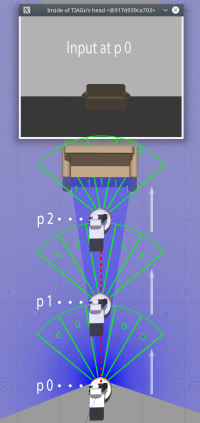

# ss20_02_feature_extraction

To process the recorded bagfiles further, a dataset for training needs to be 
created. 

At this step, the recorded sensor data from the camera and lasers,
are connected with each other and merged as one h5py dataset. The file 
**feature_extraction.py**, collects the stored bagfiles from **/root/.ros/bagfiles**
and stores them along with a dataset in two folders called **/bagfiles**
and **/datasets**. Every batch of bagfiles and corresponding dataset, will be saved 
in a subfolder of **/datasets** or **/bagfiles** with a unique identifier in order
to relate corresponding files for testing and comparing the models. To provide
more flexibility, the user is able to chose a batch of existing files or new
files recorded from .ros/bagfiles. It is additionally possible to launch the
script with parameters.

Following commands can be used at this step:
```bash
python3 feature_extraction.py
```

To increase the performance of the model, recorded images at position 0 are not 
just related to laser input at position zero but also with future positions of
laser input data. Following screenshot which simplifies this procedure shows a 
recorded image at position 0. This image will be related to laser data of
position 0 - 2. Every image recorded will be related to all future positions
along the red line till the goal.



Following table shows how camera input is related to future laser input using
the simplified data from the image above.

<table class="tg">
<thead>
  <tr>
    <th class="tg-0pky"></th>
    <th class="tg-0pky"></th>
    <th class="tg-nlhk" colspan="5" style="text-align:center">p 0</th>
    <th class="tg-nlhk" colspan="5">p 1</th>
    <th class="tg-nlhk" colspan="5">p 2</th>
  </tr>
</thead>
<tbody>
  <tr>
    <td class="tg-fymr">Time</td>
    <td class="tg-fymr">Camera Input</td>
    <td class="tg-qlio">R_1</td>
    <td class="tg-qlio">R_2</td>
    <td class="tg-qlio">R_3</td>
    <td class="tg-qlio">R_4</td>
    <td class="tg-qlio">R_5</td>
    <td class="tg-iziz">R_1</td>
    <td class="tg-iziz">R_2</td>
    <td class="tg-iziz">R_3</td>
    <td class="tg-iziz">R_4</td>
    <td class="tg-iziz">R_5</td>
    <td class="tg-qlio">R_1</td>
    <td class="tg-qlio">R_2</td>
    <td class="tg-qlio">R_3</td>
    <td class="tg-qlio">R_4</td>
    <td class="tg-qlio">R_5</td>
  </tr>
  <tr>
    <td class="tg-0pky">00:00:01</td>
    <td class="tg-0pky">[178,...256]</td>
    <td class="tg-lg8x">0</td>
    <td class="tg-lg8x">0</td>
    <td class="tg-lg8x">0</td>
    <td class="tg-lg8x">0</td>
    <td class="tg-lg8x">0</td>
    <td class="tg-90ok">0</td>
    <td class="tg-90ok">0</td>
    <td class="tg-90ok">0</td>
    <td class="tg-90ok">0</td>
    <td class="tg-90ok">0</td>
    <td class="tg-lg8x">1</td>
    <td class="tg-lg8x">1</td>
    <td class="tg-lg8x">1</td>
    <td class="tg-lg8x">1</td>
    <td class="tg-lg8x">1</td>
  </tr>
</tbody>
</table>