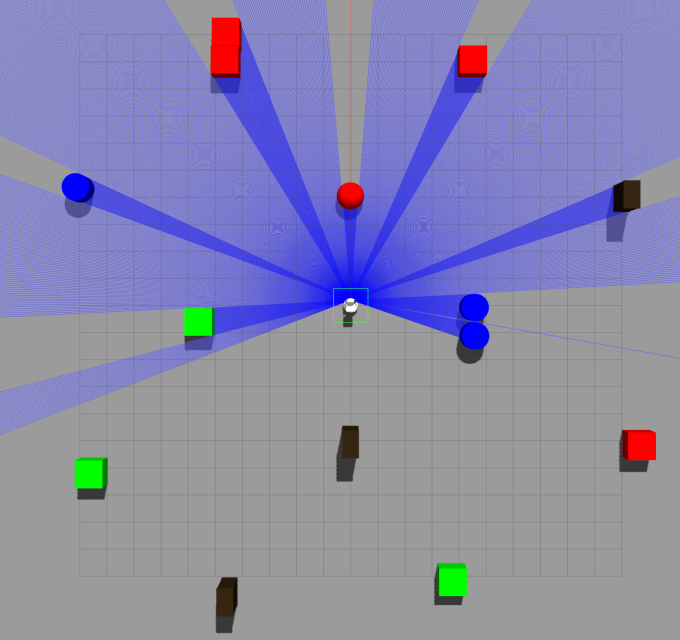

# ss20_07_deploying_model

This package implements an obstacle avoidance controller and functions to test the deployed model.
Algorithms used are the Bug as well as an Intermediary Goal Algorithm. The node furthermore provides
a heatmap, which allows the user to display the prediction as a visualized plot. The environment
suitable to this node can be seen in the image below.



The node needs to be launched within the provided docker environment with follow commands:

Launch Gazebo with TIAGo
```bash
source ~/tiago_public_ws/devel/setup.bash
roslaunch tiago_gazebo tiago_gazebo.launch public_sim:=true robot:=steel
```

Launch environment
```bash
rosrun gazebo_ros spawn_model -file /root/catkin_ws/src/ss20_lanz_2d_obstacle_avoidance/source/files/environments/final/model.sdf -sdf -model model7
```

Launch node
```bash
source ~/catkin_ws/devel/setup.bash
roslaunch ss20_07_deploying_model ss20_07_deploying_model.launch
```